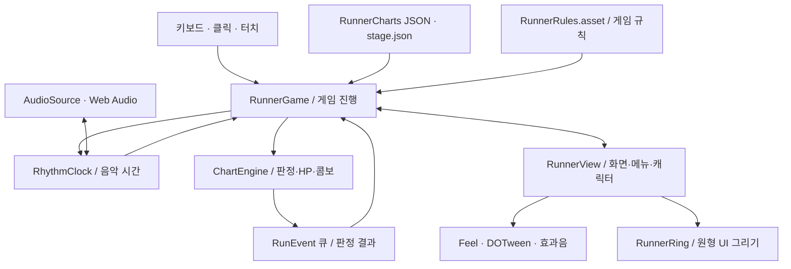
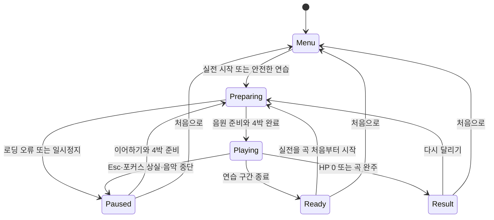
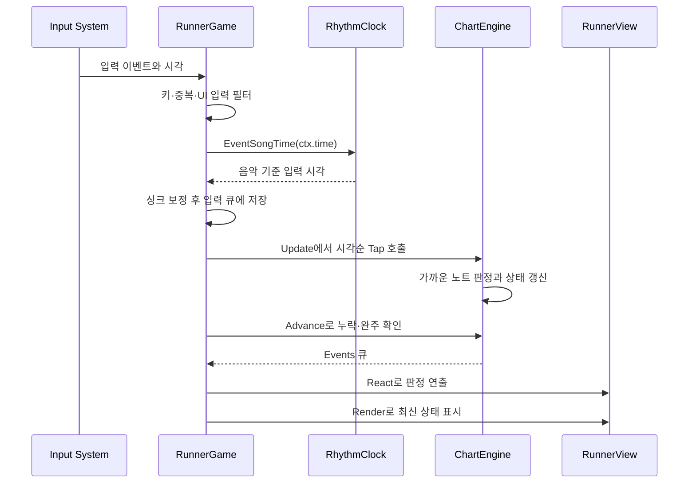
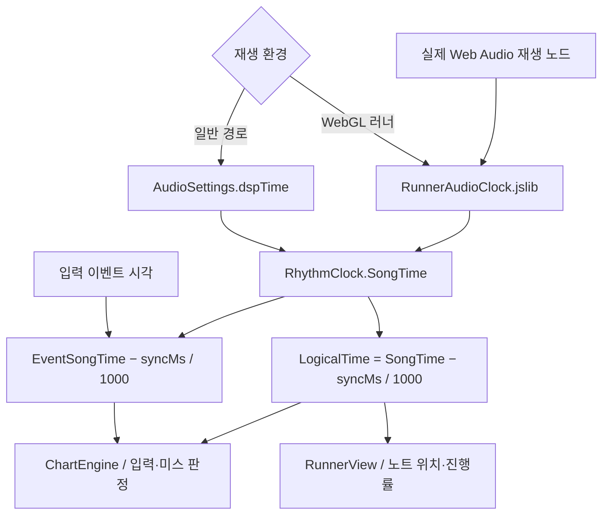
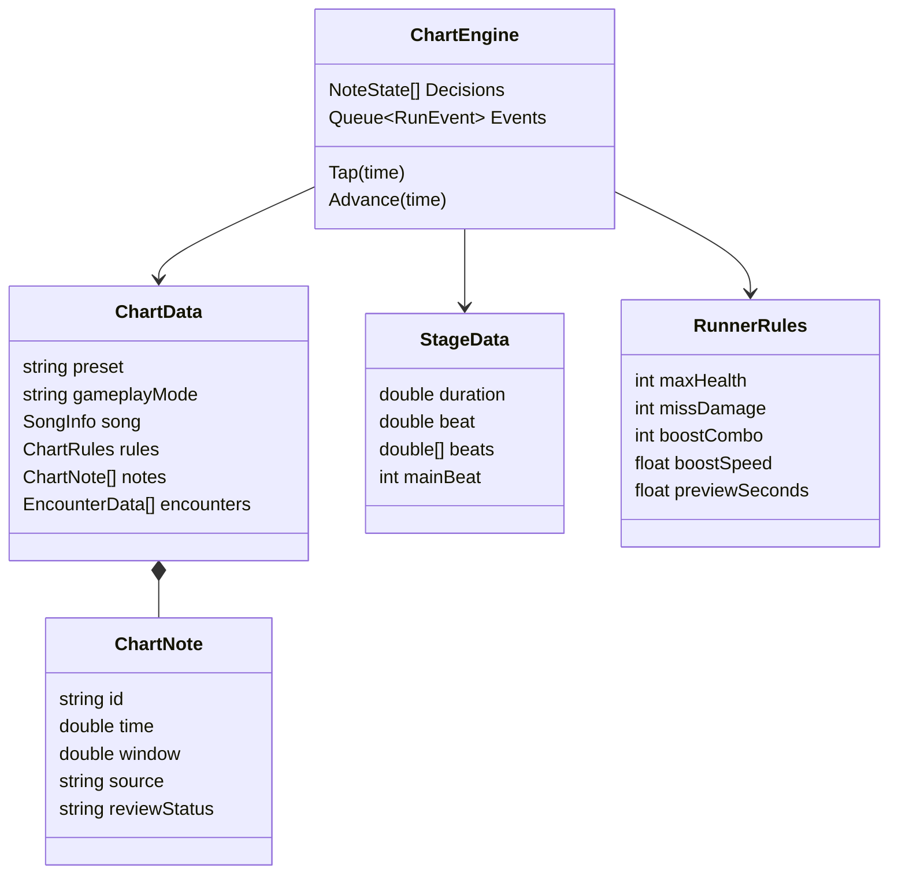
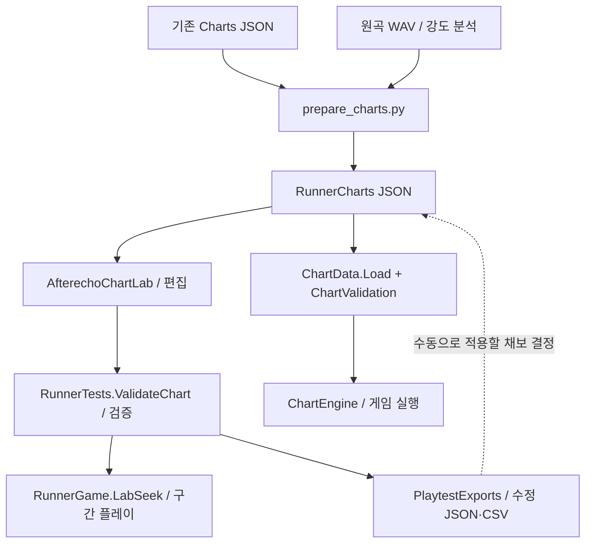
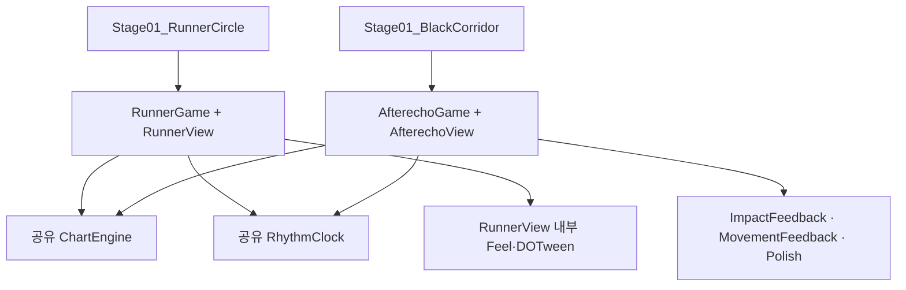
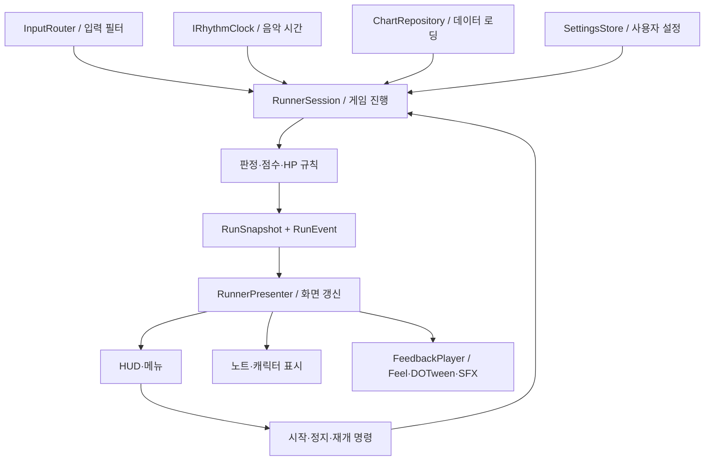

# AFTERECHO 코드 구조와 아키텍처

분석일: 2026-09-21 · 저장소: [eddy0626/afterecho](https://github.com/eddy0626/afterecho)

분석 기준: `main`의 커밋 `6c5ffd5cac08528d9a8ff70ab58b0ef7fb71d4a0`. README는 개발 브랜치를 `feature/runner-circle`로 안내하지만, 이 문서는 제공된 저장소의 기본 브랜치 스냅샷을 분석했다. PC의 미커밋 변경은 포함하지 않는다.

## 1. 먼저 이해할 핵심

**음악 시간을 기준으로 노트 입력을 판정하고, 그 결과를 러너 연출로 보여주는 Unity 리듬게임이다.** 현재 러너 버전과 이전 복도·전투 버전이 공존한다. 두 버전은 판정 엔진과 음악 시계를 공유한다.

러너 버전의 중심은 네 가지다.

| 구성요소 | 쉬운 설명 | 실제 책임 |
|---|---|---|
| `RunnerGame` | 게임의 진행 담당자 | 시작·연습·일시정지·재개·입력·종료 조율 |
| `RhythmClock` | 음악 기준 시계 | 음원 로딩, 4박 준비, 재생 시간, 중단 감지 |
| `ChartEngine` | 판정과 점수 계산기 | 노트 성공·미스, HP, 콤보, 점수, 승패 |
| `RunnerView` | 화면과 연출 담당자 | 원형 노트, HUD, 메뉴, 캐릭터 이동, 이펙트·효과음 |

현재 구조는 **중앙 진행 제어 + 시간 기반 판정 엔진 + 화면·연출 계층**으로 설명할 수 있다. 다만 `RunnerView`가 `RunnerGame`을 직접 참조하고 UI 명령을 호출하므로, 완전히 단방향으로 분리된 MVC/MVP 구조는 아니다.

분석한 자체 코드: `Assets/Afterecho/Runtime` 12개, `Editor` 8개 C# 파일. 핵심 실행 코드를 상세 검토하고 러너 씬, 규칙 에셋, 난이도별 채보, 빌드 프로필, WebGL 플러그인을 대조했다. 에셋 업체의 전체 라이브러리나 아트 파일은 전수 검토하지 않았다. Unity를 실행하거나 기존 테스트를 재실행하지 않은 정적 분석이다.

## 2. 현재 전체 구조도

아래 화살표는 데이터 전달 또는 호출 방향이다. 양방향 화살표는 화면 명령과 상태 조회가 서로 연결되어 있음을 뜻한다.

`RunnerGame.Consume()`이 엔진의 이벤트 큐를 비우면서 `RunnerView.React()`를 호출한다. 범용 이벤트 버스나 자동 구독 시스템은 없다. `RunnerView.Render()`는 진행 상태와 엔진 수치를 직접 읽는다.

**캐릭터의 위치로 노트 판정을 하지 않는다.** 노트의 목표 시각과 입력 시각의 차이로 판정한다. 캐릭터는 사각형 트랙을 시간에 따라 달리며, 질주·넘어짐이 시각적 이동 속도를 바꾼다. 러너 이동은 Rigidbody 기반 물리 이동이 아니라 Canvas의 `RectTransform` 위치 계산이다.

근거: [RunnerGame.cs](https://github.com/eddy0626/afterecho/blob/6c5ffd5cac08528d9a8ff70ab58b0ef7fb71d4a0/Assets/Afterecho/Runtime/RunnerGame.cs), [ChartEngine.cs](https://github.com/eddy0626/afterecho/blob/6c5ffd5cac08528d9a8ff70ab58b0ef7fb71d4a0/Assets/Afterecho/Runtime/ChartEngine.cs), [RunnerView.cs](https://github.com/eddy0626/afterecho/blob/6c5ffd5cac08528d9a8ff70ab58b0ef7fb71d4a0/Assets/Afterecho/Runtime/RunnerView.cs).

## 3. 폴더별 역할과 읽는 순서

| 경로 | 들어 있는 것 | 구조를 볼 때의 중요도 |
|---|---|---|
| `Assets/Afterecho/Runtime/` | 직접 작성한 게임 실행 코드 | 가장 먼저 |
| `Assets/Afterecho/Resources/Afterecho/RunnerCharts/` | 현재 러너 난이도별 채보 | 노트·난이도 수정 |
| `Assets/Afterecho/Resources/Afterecho/Charts/` | 이전 복도 버전 채보 | 이전 버전 및 러너 채보 생성 원본 |
| `Assets/Afterecho/Resources/Afterecho/stage.json` | 곡 길이·박자·구간·이전 경로 등 | 공통 스테이지 데이터 |
| `Assets/Afterecho/Runner/` | 러너 규칙 에셋·아트·효과음 | 밸런스·연출 조정 |
| `Assets/Afterecho/Scenes/` | 러너 씬과 이전 복도 씬 | 실제 컴포넌트 연결 |
| `Assets/Afterecho/Editor/` | 채보 편집기·씬 생성기·검증 도구 | 기획·개발 작업 도구 |
| `Assets/Afterecho/Plugins/WebGL/` | 브라우저 오디오 연결 | WebGL 음악 동기화 |
| `Assets/Settings/Build Profiles/` | 버전별 빌드 프로필 | 빌드할 씬 선택 |
| `Assets/Feel/`, `Assets/Plugins/Demigiant/` | Feel, DOTween 등 외부 에셋 | 자체 게임 구조를 읽은 뒤 확인 |
| `Tools/Runner/` | 채보 가공·빌드 보조·회귀검사 스크립트 | 제작 파이프라인 |
| `ArtProduction/Runner/` | 아트·음원 제작 소스 | 제작 원본 |
| `PlaytestExports/` | 테스트 기록·채보 수정본·CSV·보고서 | 결과물 확인; 게임이 자동 로딩하는 위치는 아님 |

추천 읽기 순서: **RunnerRules → RunnerGame → ChartEngine → RhythmClock → RunnerView → AfterechoChartLab → RunnerSceneBuilder**.

### 씬과 빌드의 실제 연결

`Stage01_RunnerCircle.unity`의 스크립트 GUID를 대조하면 `RunnerGame` 1개, `RunnerView` 1개, `RhythmClock` 1개, `RunnerRing` 14개가 연결되어 있다. 14개는 고정 목표 원 1개·접근 노트 풀 12개·명중 반응 원 1개로, 생성 코드와도 일치한다. `ChartEngine`은 일반 C# 객체이므로 씬 컴포넌트가 아니다.

`RunnerSceneBuilder`는 루트, 카메라, 오디오, Canvas, UI 및 참조를 구성해 씬에 저장한다. 실행 중 초기화에서는 Feel 플레이어와 잔상·발밑 효과 풀 등을 추가한다.

전역 `EditorBuildSettings.asset`에는 복도 씬이 활성화되어 있다. 러너 프로필 `Afterecho_RunnerCircle_Web_Test.asset`은 `m_OverrideGlobalSceneList: 1`로 러너 씬을 별도 지정한다. **러너를 빌드할 때는 러너 전용 프로필을 기준으로 확인해야 한다.**

근거: [러너 씬](https://github.com/eddy0626/afterecho/blob/6c5ffd5cac08528d9a8ff70ab58b0ef7fb71d4a0/Assets/Afterecho/Scenes/Stage01_RunnerCircle.unity), [씬 생성기](https://github.com/eddy0626/afterecho/blob/6c5ffd5cac08528d9a8ff70ab58b0ef7fb71d4a0/Assets/Afterecho/Editor/RunnerSceneBuilder.cs), [러너 빌드 프로필](https://github.com/eddy0626/afterecho/blob/6c5ffd5cac08528d9a8ff70ab58b0ef7fb71d4a0/Assets/Settings/Build%20Profiles/Afterecho_RunnerCircle_Web_Test.asset), [전역 빌드 설정](https://github.com/eddy0626/afterecho/blob/6c5ffd5cac08528d9a8ff70ab58b0ef7fb71d4a0/ProjectSettings/EditorBuildSettings.asset).

## 4. 한 판의 실행 흐름

### 초기화와 상태 전환

`RunnerGame.Awake()`에서 스테이지 JSON과 사용자 설정을 읽고 입력 액션을 연결한다. `NewRun()`은 난이도에 맞는 채보를 읽어 새 `ChartEngine`을 만들고, `RunnerView.Initialize()`가 버튼과 화면을 준비한다.

`GamePhase`는 화면과 플레이 진행 상태이고, `RunStatus`는 판정 엔진 내부의 승패 상태다. 러너는 주로 `Running / Won / Lost`를 사용하고, `Arrived`는 이전 복도 버전의 문 도착 상태다.

안전한 연습은 초반 구간을 미리 플레이하는 기능이다. 연습 종료 뒤 실전을 선택하면 기존 판을 이어가지 않고, 음악과 엔진을 0초부터 새로 시작한다.

### 입력 한 번이 처리되는 순서

중요한 순서는 **이미 들어온 입력을 먼저 처리하고 현재 시각의 미스 판정을 진행하는 것**이다. 입력 이벤트를 단순히 프레임 도착 시각으로 처리하지 않고 실제 이벤트 시각을 음악 시간으로 변환한다.

필터에는 키 홀드 중복 방지, 예약 키 제외, 터치·마우스 중복 억제, UI Selectable 클릭 제외가 있다. 엔진에도 25ms 이내 입력을 `bounce`로 제외하는 처리가 있다.

근거: [RunnerGame.Input / Update / Consume](https://github.com/eddy0626/afterecho/blob/6c5ffd5cac08528d9a8ff70ab58b0ef7fb71d4a0/Assets/Afterecho/Runtime/RunnerGame.cs), [ChartEngine.Tap / Advance](https://github.com/eddy0626/afterecho/blob/6c5ffd5cac08528d9a8ff70ab58b0ef7fb71d4a0/Assets/Afterecho/Runtime/ChartEngine.cs).

## 5. 음악 시간과 게임 시간

- `RhythmClock.Schedule()`은 오디오 준비 후 카운트인과 음악을 예약한다.
- WebGL 러너는 실제 브라우저 음원 재생 위치를 읽는다. `.jslib`는 Unity의 `WEBAudio` 객체를 통해 원곡 길이와 맞는 채널을 찾고 재생 속도를 1로 맞춘다.
- `LogicalTime`은 싱크 보정이 적용된 판정 시각이다. 사용자 설정 범위는 ±250ms다.
- `ActiveSeconds`는 플레이 중 진행량을 누적해 캐릭터 프레임·넘어짐·잔상 등에 사용한다.
- 일부 짧은 시각 효과는 `Time.unscaledTime`을 사용한다. 모든 연출이 음악 시간 하나만 쓰는 구조는 아니다.
- 일시정지 때 `SafeResume()`가 다음 미판정 노트를 놓치지 않을 위치를 계산한다. 따라서 재개 시각은 정지 시각보다 조금 앞일 수 있다.
- `DeferCompletion`은 음수 싱크 보정으로 판정 시각이 먼저 끝나도 실제 곡 꼬리를 자르지 않게 한다. WebGL 양수 보정의 곡 종료 이후 판정 꼬리도 시계에서 처리한다.

**15콤보 이후 2.4배는 러너의 트랙 이동 속도다. 음악 피치와 채보 시각은 바뀌지 않는다.**

근거: [RhythmClock.cs](https://github.com/eddy0626/afterecho/blob/6c5ffd5cac08528d9a8ff70ab58b0ef7fb71d4a0/Assets/Afterecho/Runtime/RhythmClock.cs), [RunnerAudioClock.jslib](https://github.com/eddy0626/afterecho/blob/6c5ffd5cac08528d9a8ff70ab58b0ef7fb71d4a0/Assets/Afterecho/Plugins/WebGL/RunnerAudioClock.jslib), [RunnerView.AdvanceRunner](https://github.com/eddy0626/afterecho/blob/6c5ffd5cac08528d9a8ff70ab58b0ef7fb71d4a0/Assets/Afterecho/Runtime/RunnerView.cs).

## 6. 데이터 구조와 수정 위치

### 데이터의 관계

`RunnerRules`가 전달되면 엔진은 러너 모드로 동작한다. 실제 분기 기준은 `ChartData.gameplayMode` 문자열이 아니라 **RunnerRules 존재 여부**다. 러너에서는 적 배열을 비우고 미스·헛입력으로 HP를 차감한다.

### 현재 적용값

| 바꾸고 싶은 내용 | 현재 값 | 수정 기준 |
|---|---|---|
| 최대 HP | 100 | `RunnerRules.asset → maxHealth` |
| 성공 HP 회복 | +1 | `hitRecovery` |
| 미스 피해 | −10 | `missDamage` |
| 헛입력 피해 | −3 | `extraDamage` |
| 질주 시작 | 15콤보 | `boostCombo` |
| 기본 트랙 한 바퀴 | 12초 | `lapSeconds` |
| 질주 속도 | 2.4배 | `boostSpeed`; 음악 속도는 그대로 |
| 노트 미리보기 | 1.2초 | `previewSeconds` |
| 넘어짐 연출 시간 | 0.35초 | `fallSeconds` |
| 넘어졌을 때 이동 배율 | 0.22배 | `RunnerView.AdvanceRunner()`에 상수 |
| 기본 성공 점수 | 100 × 배율 | `ChartEngine.Resolve()` |
| 콤보 점수 배율 | 8콤보부터 ×2, 24콤보부터 ×4 | `ChartEngine.Multiplier` |
| PERFECT 표시 | 오차 ≤ min(35ms, 실제 판정창 × 0.5) | `RunnerView.React()` |
| 배경색 전환 시각 | 43.59초 / 86.995초 | `RunnerView.Render()`에 상수 |
| 곡 길이 | 136.36초 | `stage.json` 및 채보의 song 정보 |
| 노트 시각·밀도 | 난이도별 상이 | `RunnerCharts/*.json` 또는 Chart Lab |

현재 `PERFECT / GOOD`은 화면·효과음 차이다. 엔진은 둘 다 성공으로 처리해 같은 점수 및 HP 회복 규칙을 적용한다. PERFECT별 별도 점수가 필요하면 판정 결과 모델부터 확장하는 것이 맞다.

`RunnerRules.cs`의 필드 초기값을 바꾸는 것과 기존 `RunnerRules.asset`의 저장값을 바꾸는 것은 별개다. **이미 생성된 게임의 밸런스는 연결된 에셋 값을 수정해야 한다.** `RunnerView.Menu()`·`Ready()`에는 “15콤보”, “−10/−3/+1” 등의 안내 문구도 고정되어 있어 규칙 변경 때 함께 확인해야 한다.

### 난이도별 현재 채보

| 난이도 | 노트 수 | 최대 판정창 | 최소 간격 규칙 | 빠른 연타 기준 | 연타 후 회복 간격 |
|---|---:|---:|---:|---:|---:|
| 입문 `easy` | 239 | ±100ms | 0.30초 | 0.39초 | 0.55초 |
| 보통 `normal` | 257 | ±80ms | 0.22초 | 0.33초 | 0.44초 |
| 도전 `hard` | 289 | ±60ms | 0.16초 | 0.27초 | 0.40초 |

실제 노트별 판정창은 `min(maxWindow, 0.4 × min(앞 노트 간격, 뒤 노트 간격))`로 다시 계산한다. JSON의 `notes[].window`만 고쳐도 실제 판정창이 그대로 바뀌는 것은 아니다. 표의 간격은 설정 규칙이며 모든 노트 간격이 동일하다는 뜻은 아니다.

`stage.json`에는 `window`, `maxMisses` 등 이전 자료의 필드가 남아 있지만 현재 `StageData` 클래스에는 그 필드가 없다. 특히 **stage.json의 maxMisses를 수정해도 현재 러너의 HP 규칙은 바뀌지 않는다.** 러너 HP는 `RunnerRules.asset`에서 읽는다.

근거: [RunnerRules.asset](https://github.com/eddy0626/afterecho/blob/6c5ffd5cac08528d9a8ff70ab58b0ef7fb71d4a0/Assets/Afterecho/Runner/RunnerRules.asset), [입문 채보](https://github.com/eddy0626/afterecho/blob/6c5ffd5cac08528d9a8ff70ab58b0ef7fb71d4a0/Assets/Afterecho/Resources/Afterecho/RunnerCharts/easy.json), [보통 채보](https://github.com/eddy0626/afterecho/blob/6c5ffd5cac08528d9a8ff70ab58b0ef7fb71d4a0/Assets/Afterecho/Resources/Afterecho/RunnerCharts/normal.json), [도전 채보](https://github.com/eddy0626/afterecho/blob/6c5ffd5cac08528d9a8ff70ab58b0ef7fb71d4a0/Assets/Afterecho/Resources/Afterecho/RunnerCharts/hard.json), [stage.json](https://github.com/eddy0626/afterecho/blob/6c5ffd5cac08528d9a8ff70ab58b0ef7fb71d4a0/Assets/Afterecho/Resources/Afterecho/stage.json).

## 7. 채보 편집·검증 파이프라인

`prepare_charts.py`는 기존 채보와 음원의 순간 강도 정보를 이용해 밀도 충돌 노트를 줄여 러너 채보를 만든다. 런타임에서 AI가 채보를 생성하는 구조가 아니다.

Chart Lab은 러너/이전 버전 선택, 노트 시각 변경·추가·삭제, 자동 입력, 무적, 구간 반복, 입력 로그 내보내기를 지원한다. 수정본 저장은 `PlaytestExports`에 별도 JSON을 만드는 동작이다. **수정본을 저장했다고 기본 RunnerCharts가 자동 교체되거나 빌드에 반영되지는 않는다.**

런타임 `ChartValidation`은 필수값, 숫자 안전성, 시각 정렬, 스테이지·러너 설정 등을 검사한다. 편집기 `RunnerTests.ValidateChart()`는 노트 최소 간격, 연타 회복, 동시 미리보기 밀도 등을 추가 검사한다. 검증 범위가 완전히 동일하지 않다.

기존 테스트는 판정 경계, 중복 입력, HP, 질주, 무입력 패배, 완주, 안전한 재개, 잘못된 설정 등을 다룬다. 이 문서 작성 과정에서 테스트를 실행한 것은 아니다.

설정 확장 시 점검할 부분: 편집기 밀도 검사는 1.2초와 최대 5개를 상수로 쓰고, 런타임 노트 풀은 12개다. `previewSeconds`를 바꿔도 검증 기준이 자동으로 따라오지 않는다. 연타 검사에도 4회 상수가 있어 `burstLimit` 필드를 완전히 데이터화하려면 함께 정리해야 한다.

근거: [AfterechoChartLab.cs](https://github.com/eddy0626/afterecho/blob/6c5ffd5cac08528d9a8ff70ab58b0ef7fb71d4a0/Assets/Afterecho/Editor/AfterechoChartLab.cs), [RunnerTests.cs](https://github.com/eddy0626/afterecho/blob/6c5ffd5cac08528d9a8ff70ab58b0ef7fb71d4a0/Assets/Afterecho/Editor/RunnerTests.cs), [ChartValidation.cs](https://github.com/eddy0626/afterecho/blob/6c5ffd5cac08528d9a8ff70ab58b0ef7fb71d4a0/Assets/Afterecho/Runtime/ChartValidation.cs), [prepare_charts.py](https://github.com/eddy0626/afterecho/blob/6c5ffd5cac08528d9a8ff70ab58b0ef7fb71d4a0/Tools/Runner/prepare_charts.py).

## 8. 현재 러너와 이전 복도 버전의 관계

| 구분 | 현재 러너 | 이전 복도·전투 |
|---|---|---|
| 진행 제어 | `RunnerGame` | `AfterechoGame` |
| 화면 | `RunnerView` | `AfterechoView` |
| 채보 위치 | `RunnerCharts/` | `Charts/` |
| 엔진 모드 | RunnerRules 전달 | RunnerRules 미전달 |
| HP | 성공 회복, 미스·헛입력 차감 | 적 공격에 따른 피해 |
| 캐릭터 이동 | 시간 기반 사각 트랙 순환 | 성공 스텝 수를 경로 위치로 변환 |
| 종료 | 곡 완주 또는 HP 0 | 문 도착 후 곡 종료 또는 HP 0 |
| 연출 구성 | View 내부에 집중 | 별도 Impact·Movement·Polish 컴포넌트 |

`AfterechoPolish`는 씬 로드 후 `AfterechoGame`을 찾아 자동 부착된다. 따라서 씬 파일에 연결된 스크립트 목록만으로 모든 이전 버전 연출을 파악하기 어렵다.

`GamePhase` enum은 현재 `AfterechoGame.cs`에 선언되어 있고 러너도 이를 사용한다. 이전 버전을 정리한다며 해당 파일을 바로 삭제하면 공통 enum 의존성을 놓칠 수 있다.

근거: [AfterechoGame.cs](https://github.com/eddy0626/afterecho/blob/6c5ffd5cac08528d9a8ff70ab58b0ef7fb71d4a0/Assets/Afterecho/Runtime/AfterechoGame.cs), [AfterechoView.cs](https://github.com/eddy0626/afterecho/blob/6c5ffd5cac08528d9a8ff70ab58b0ef7fb71d4a0/Assets/Afterecho/Runtime/AfterechoView.cs), [AfterechoPolish.cs](https://github.com/eddy0626/afterecho/blob/6c5ffd5cac08528d9a8ff70ab58b0ef7fb71d4a0/Assets/Afterecho/Runtime/AfterechoPolish.cs).

## 9. 구조를 기반으로 제안하는 아키텍처

이 절은 **아직 구현되지 않은 개선 설계**다. 현재 판정 엔진과 음악 기준 처리 방식을 유지하면서, `RunnerGame`과 `RunnerView`에 모인 책임을 단계적으로 나누는 방향이다.

### 책임별 구체적인 분리안

| 현재 코드 | 제안 모듈 | 옮길 책임 | 기대 효과 |
|---|---|---|---|
| `RunnerGame.Input()`과 입력 큐 | `InputRouter` | 장치 필터·중복 방지·입력 수집 | 입력 수정이 게임 상태 코드에 덜 영향 |
| `RunnerGame`의 진행 함수 | `RunnerSession` | 시작·연습·정지·재개·종료 | 한 판의 상태 전환을 한곳에서 이해 |
| `Resources.Load`와 JSON 변환 | `ChartRepository` | 채보·스테이지 로딩과 검증 | 곡 추가 때 로딩 경로 교체가 쉬움 |
| `PlayerPrefs` 읽기·쓰기 | `SettingsStore` | 볼륨·싱크·움직임 설정 | 설정 저장 책임 분리 |
| `RhythmClock` | `IRhythmClock` 구현체 | 기존 DSP/WebGL 처리 유지 | 테스트 시 실제 음악 대신 시각 주입 가능 |
| `ChartEngine` | 판정 엔진 + 모드별 규칙 | 공통 노트 판정과 러너/전투 결과 처리 구분 | 모드 분기 증가 억제 |
| `RunnerView`의 UI 함수 | `RunnerHudView` / `RunnerMenuView` | 상태 표시·버튼 명령 | UI 변경 범위 축소 |
| `RenderNotes` / `RunnerRing` | `NoteRingView` | 접근 노트 풀과 렌더링 | 채보 시각화 독립 |
| `AdvanceRunner` / 프레임 처리 | `RunnerCharacterView` | 트랙 이동·달리기·넘어짐 | 캐릭터 연출 교체 용이 |
| `React` / Feel·DOTween·SFX | `RunnerFeedbackPlayer` | 판정 결과에 따른 연출 | 연출 수정이 게임 진행에 덜 영향 |
| Chart Lab의 Game 직접 참조 | `IChartPreviewHost` | 구간 재생·오토·무적·로그 접근 | 편집기의 모드 분기 축소 |

처음부터 모두 나눌 필요는 없다. 현재 규모에서는 **공통 타입 정리 → View 책임 분리 → 입력/설정 분리 → 모드별 규칙 분리** 순서가 적절하다.

### 제안 폴더 구성

| 제안 경로 | 배치할 내용 |
|---|---|
| `Runtime/Core/Models/` | ChartData, StageData, RunEvent, GamePhase |
| `Runtime/Core/Judgement/` | 노트 판정·판정창·검증 |
| `Runtime/Core/Rules/` | 점수·HP·콤보 규칙과 읽기 전용 설정 |
| `Runtime/Application/` | RunnerSession, 입력/화면 사이 조율 |
| `Runtime/Infrastructure/Audio/` | RhythmClock, WebGL 브리지 연결 |
| `Runtime/Infrastructure/Input/` | Input System 어댑터 |
| `Runtime/Infrastructure/Data/` | Resources 기반 로딩, PlayerPrefs |
| `Runtime/Presentation/Runner/` | HUD, 메뉴, 노트, 캐릭터, 피드백 |
| `Runtime/Legacy/` | 이전 복도 전용 진행·화면·연출 |
| `Editor/ChartLab/` | 채보 편집·미리보기 |
| `Editor/SceneBuilders/` | 씬 생성 및 아트 연결 |
| `Tests/` | 규칙·상태 전환·통합 회귀검사 |

이 경로들은 제안이며 현재 저장소에 생성한 것이 아니다. Unity 파일을 실제 이동할 때는 `.meta`와 GUID를 보존해야 한다.

### 유지해야 할 설계 원칙

1. **음악 시각이 판정 기준이다.** 화면 프레임이나 캐릭터 이동으로 판정 시계를 대체하지 않는다.
2. **상태 계산과 연출을 구분한다.** 이펙트 실행·취소가 HP나 노트 성공 여부를 바꾸지 않게 한다.
3. **규칙의 기준값은 하나로 둔다.** Inspector 값, 안내 문구, 편집기 검증이 같은 설정을 사용하게 한다.
4. **진행 제어가 이벤트를 소비한다.** 지금의 큐 방식을 유지해도 충분하며 큰 이벤트 프레임워크가 필수는 아니다.
5. **공통부는 이전 화면에 의존하지 않게 한다.** GamePhase와 데이터 모델을 먼저 공통 위치로 이동한다.

현재 ChartEngine은 MonoBehaviour나 프레임 시간·오디오에 의존하지 않아 테스트하기 좋은 출발점이다. 다만 같은 파일의 JSON 로딩은 `JsonUtility`를 쓰고 규칙은 `ScriptableObject`를 참조한다. 완전히 Unity 밖에서 테스트하려면 데이터 변환과 설정 객체도 분리해야 한다.

## 10. 우선순위와 확인할 변화

| 순서 | 변경 | 확인해야 하는 동작 |
|---|---|---|
| 1 | GamePhase·데이터 모델을 공통 파일로 분리 | 두 버전 모두 기존 상태와 채보를 유지 |
| 2 | 규칙 변경 시 안내 문구와 밀도 검증도 같은 설정 사용 | boostCombo·피해·previewSeconds 변경이 일치 |
| 3 | RunnerView에서 피드백·캐릭터 표시 분리 | HP·점수·판정 시각은 기존과 동일 |
| 4 | 입력 필터와 저장 설정 분리 | UI 클릭 제외·홀드·터치 중복 방지 유지 |
| 5 | 문자열 RunEvent.kind를 enum으로 전환 | 이벤트 누락·잘못된 문자열 분기 방지 |
| 6 | 다곡 확장 시 SongDefinition 도입 | 곡별 음원·스테이지·난이도 채보를 한 묶음으로 로딩 |
| 7 | 필요할 때 Core/Runtime/Editor asmdef 분리 | 외부 에셋과 런타임/편집기 의존 방향 검증 |

추가 관찰: WebGL 오디오 브리지는 Unity 내부 `WEBAudio` 구조를 사용한다. Unity 업그레이드 시 확인해야 할 구체적인 호환 지점이다. 검토한 자체 런타임에는 별도 계정·랭킹 서버나 서버 저장 호출이 없고, 사용자 설정은 PlayerPrefs, 플레이 상태와 입력 로그는 메모리에 둔다. 향후 기록 저장·랭킹이 필요해질 때 별도의 저장 모듈을 추가하면 된다.

## 11. 기능별 빠른 탐색표

| 질문 | 먼저 볼 곳 |
|---|---|
| 게임은 어디서 시작되는가? | `RunnerGame.Awake / StartRun / Schedule` |
| 무엇을 눌러야 판정되는가? | `RunnerGame.Input / IsGameplayKey` |
| 성공과 미스를 어떻게 계산하는가? | `ChartEngine.Tap / Window / Advance` |
| HP와 점수는 어디서 바뀌는가? | `ChartEngine.Resolve / ApplyRunnerDamage` |
| 왜 음악과 원이 어긋나는가? | `RhythmClock`, `syncMs`, WebGL `.jslib` |
| 왜 질주 속도가 빨라지는가? | `ChartEngine.Boosted → RunnerView.AdvanceRunner` |
| 메뉴와 결과창은 어디 있는가? | `RunnerView.Menu / Pause / Ready / Result` |
| 노트 타이밍은 어디서 고치는가? | `Afterecho > Chart Lab`, `RunnerCharts/*.json` |
| 채보 수정본이 빌드에 안 들어가는 이유는? | `PlaytestExports` 수정본과 `RunnerCharts` 기본 파일 비교 |
| 씬을 다시 만드는 코드는? | `RunnerSceneBuilder.Build` |
| 예전 복도 코드와 공유하는 부분은? | `ChartEngine`, `RhythmClock`, `ChartValidation`, 데이터 모델 |

이 문서는 구조 설명과 개선 설계만 작성했으며, 저장소의 게임 코드·씬·밸런스는 변경하지 않았다.
